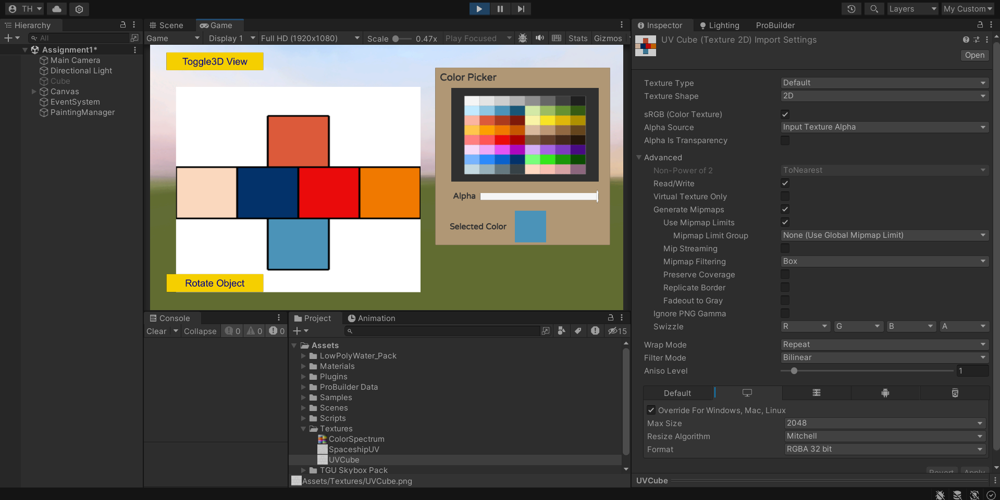

# GridColor-Craze 🎨

**GridColor-Craze** is a creative coloring game where players fill grids with vibrant colors to create stunning designs. The game combines artistic expression, making it enjoyable for players of all ages. Whether you're a seasoned artist or just looking for a fun way to relax, GridColor-Craze offers endless possibilities to let your creativity shine.

## 🎮 Features

- **Click-to-Paint Controls:** Simple and intuitive click controls to fill grid cells with color.
- **Varied Grid Sizes:** Play on different grid sizes, from easy to challenging.
- **Custom Color Palette:** Choose from a wide array of colors to create unique designs.
- **Relaxing Gameplay:** A soothing experience that sparks creativity and provides a calming break.

## 📸 Screenshots

Here are some screenshots of Grid Paint Pro in action:

| Gameplay 1       | Gameplay 2       | Gameplay 3       | Gameplay 4       |
| ---------------  | ---------------  | ---------------  | ---------------  |
|  |  |  |  |

## 🚀 Getting Started

### Prerequisites

- Unity 2020.3 or later
- Git for version control

### Installation

1. Clone the repository:
    ```bash
    git clone https://github.com/your-username/grid-paint-pro.git
    ```
2. Open the project in Unity:
    - Launch Unity Hub and open the project folder.

3. Play the game:
    - Press the `Play` button in Unity to start the game.

## 🛠️ Development

### Tools & Technologies

- **Unity**: The primary game engine used to develop Grid Paint Pro.
- **C#**: Scripting language used for game logic and mechanics.
- **Git**: Version control to manage project changes.

### Project Structure

- `Assets/`: Contains all game assets, including scripts, textures, and scenes.
- `Scripts/`: C# scripts for game mechanics, controls, and logic.
- `Scenes/`: Unity scenes for different levels and menus.

## 📖 How to Play

1. **Choose a color**: Select a color from the palette.
2. **Tap the grid**: Click on a grid cell to fill it with the selected color.
3. **Complete the design**: Continue filling the grid until your masterpiece is complete.

## 📝 License

This project is licensed under the MIT License - see the [LICENSE](LICENSE) file for details.

## 🤝 Contributing

Contributions are welcome! If you have ideas, suggestions, or bug reports, feel free to open an issue or submit a pull request.

## 📧 Contact

For any inquiries, please contact [taimoorulhassansiddique.13@gmail.com](mailto:taimoorulhassansiddique.13@gmail.com).

---

Thank you for playing **GridColor-Craze**! Happy painting! 🎉
